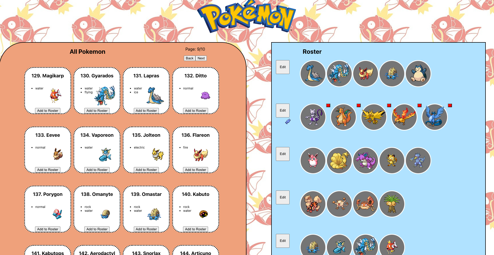

## Pokemon API

A roster management system using [PokeAPI](https://pokeapi.co/).

### Features

- Fetches first generation pokemon (151) and types
- Can select certain roster to edit
- Add and removal of pokemon from certain roster
- Pagination of the pokemon into 4x4 grids

### Future Ideas

- Filtering by type
- Adding modals for more detailed information of select pokemon